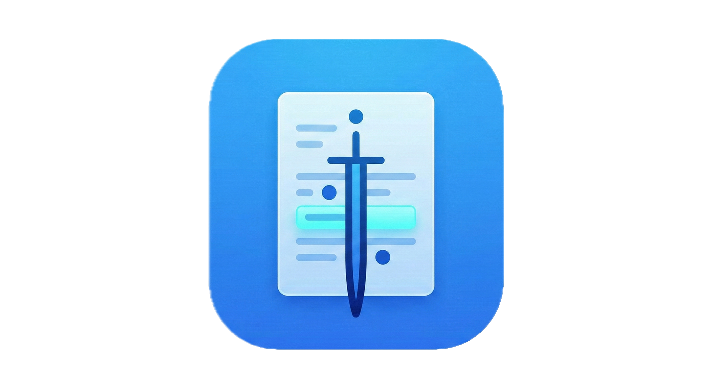

# Obelos - Firefox Extension

A powerful Firefox extension that allows you to highlight text, add annotations, and create bookmarks on any webpage with persistent storage and direct linking capabilities.

## Features

### ✨ Core Features
- **6 Color Highlights**: Choose from yellow, green, blue, pink, orange, or purple
- **Persistent Storage**: All highlights and bookmarks are saved locally and restored when you revisit the page
- **Cross-Device Sync**: Optional sync via remoteStorage protocol to access highlights across browsers and devices
- **Annotations**: Add notes to any highlight or bookmark
- **Zero-Length Anchors**: Create bookmark markers at specific positions without selecting text
- **Direct Linking**: Every highlight and bookmark gets a unique URL fragment that can be shared
- **Toggle Visibility**: Show or hide all highlights without deleting them
- **Context Menus**: Right-click highlights and bookmarks for quick actions

### 🎯 Highlights
- Select any text on a webpage
- Choose from 6 vibrant colors
- Add optional annotation text
- Click any highlight to view, edit, or delete
- Copy direct link to any highlight
- Annotations shown as tooltips on hover
- Dotted underline indicates highlights with annotations

### 🔖 Bookmarks (Anchors)
- Create position markers without selecting text
- Add optional notes
- Perfect for marking important sections
- Copy direct link to any bookmark

### 📝 Annotations
- Add notes to highlights or bookmarks
- Edit annotations at any time
- Annotations are displayed in context menus
- Visual indicator shows which items have notes

### 🔗 Direct Linking
- Every highlight and bookmark gets a unique ID
- Share exact positions on pages via URL fragments
- Links automatically scroll to and flash the target
- Perfect for collaboration and documentation

### 📄 XHTML/XML Support
- Works on complex documents like SEC EDGAR filings
- Uses iframe-based toolbar for style isolation
- Compatible with XBRL and other XML formats

### ☁️ Cross-Device Sync (Optional)
- Sync highlights across browsers and devices using remoteStorage
- Connect to providers like [5apps](https://5apps.com/storage) or self-hosted servers
- Offline-first: works without internet, syncs when connected
- Your data stays under your control

## Installation

### From Source (Development)

1. **Download the extension files** to a folder on your computer

2. **Open Firefox** and navigate to `about:debugging`

3. Click **"This Firefox"** in the left sidebar

4. Click **"Load Temporary Add-on..."**

5. Navigate to the extension folder and select the `manifest.json` file

6. The extension is now installed! Look for the highlighter icon in your toolbar

### Permanent Installation

To make the extension permanent:

1. Go to `about:config` in Firefox
2. Search for `xpinstall.signatures.required`
3. Set it to `false` (temporary extensions will persist)

Or package as a signed XPI:
1. Zip the extension folder
2. Submit to Mozilla Add-ons for signing
3. Install the signed XPI

## Usage

### Creating Highlights

1. **Select text** on any webpage
2. A floating toolbar will appear
3. **Choose a color** from the palette (default is yellow)
4. Click **"✓ Highlight"** to create a basic highlight
5. Or click **"📝 Add Note"** to create a highlight with an annotation

### Creating Bookmarks

1. **Click anywhere** on the page (or select text)
2. The floating toolbar will appear
3. Click **"🔖 Bookmark"**
4. Optionally enter a note
5. A bookmark marker (🔖) appears at that position

### Managing Highlights & Bookmarks

**Click on any highlight or bookmark** to open a menu with options:

- **Press 1**: Copy a direct URL to this item
- **Press 2**: Add or edit the annotation
- **Press 3**: Delete the highlight or bookmark

### Using the Popup Menu

Click the extension icon in your toolbar to access:

- **View Statistics**: See how many highlights and bookmarks on this page
- **Color Selection**: Change the active highlighting color
- **Toggle Visibility**: Show/hide all highlights without deleting them
- **Settings**: Configure storage options and sync
- **Clear All**: Remove all highlights and bookmarks from the current page

### Setting Up Cross-Device Sync

1. Click the extension icon and select **Settings**
2. Choose **remoteStorage** as your storage provider
3. Enter your remoteStorage address (e.g., `yourname@5apps.com`)
4. Click **Connect** - an OAuth popup will appear for authorization
5. Once connected, your highlights will sync across all connected browsers
6. Use **Upload Local Data to Remote** to migrate existing highlights

### Sharing Links

1. Click any highlight or bookmark
2. Click **"📋 Copy Link"**
3. Share the URL - when someone opens it, they'll be taken directly to that spot
4. The item will flash briefly to indicate the target

### Keyboard-Free Usage

- Select text with your mouse
- Use the floating toolbar
- All features accessible via clicking

## Technical Details

### Storage

Two storage backends available:

**Local Storage (Default)**
- Uses Firefox's `browser.storage.local` API
- Data is stored per-page URL (excluding URL fragments)
- Highlights are stored with XPath information for precise restoration
- All data persists across browser sessions

**remoteStorage (Optional)**
- Enable in Settings to sync across devices
- Uses the [remoteStorage](https://remotestorage.io/) open protocol
- Compatible with [5apps](https://5apps.com/storage), self-hosted servers, or any remoteStorage provider
- **Local-first architecture**: All data saved to local storage immediately, synced to remote in background
- Works offline - syncs when connection is available
- Uses `browser.identity` API for secure OAuth authentication

### URL Fragments

Each highlight and bookmark gets a unique ID like `ha-1702654321-abc123def`. When you visit a URL with a fragment matching this ID:

```
https://example.com/article#ha-1702654321-abc123def
```

The extension will:
1. Scroll to that item
2. Flash it briefly to draw attention
3. Keep it in view

### Data Structure

Highlights store:
- Unique ID
- Text content
- Color
- XPath location
- Start/end offsets
- Optional annotation
- Timestamp

Bookmarks store:
- Unique ID
- XPath location
- Offset position
- Optional annotation
- Timestamp

## File Structure

```
obelos/
├── manifest.json         # Extension configuration
├── content.js            # Main functionality script
├── content.css           # Styles for highlights and UI
├── storage.js            # Storage abstraction layer (local-first)
├── background.js         # Background script for sync
├── popup.html/css/js     # Browser action popup
├── options.html/css/js   # Settings page with OAuth connection
├── lib/
│   └── remotestorage.min.js  # remoteStorage.js library
├── icons/                # Extension icons
├── INSTALL.md            # Quick installation guide
└── README.md             # This file
```

## Browser Compatibility

- **Firefox**: 57+ (uses WebExtensions API)
- **Chrome**: Supported (uses Chrome extensions API)
- **Firefox Mobile**: Supported
- **XHTML/XML Documents**: Fully supported (uses iframe-based toolbar for isolation)
- Works on SEC EDGAR filings and other XBRL documents

## Limitations

- Highlights may not persist if page structure changes significantly
- Dynamic content (SPAs with heavy DOM manipulation) may lose highlights
- Some websites with strict CSP may have limited functionality
- Iframes within pages are not currently supported
- Text spanning many DOM nodes may not restore perfectly

## Privacy

- By default, all data is stored locally in your browser
- Optional remoteStorage sync uses servers you choose and control
- No data is sent to Obelos developers or third parties
- No tracking or analytics
- Your highlights and annotations are private

## Tips & Tricks

1. **Use different colors** to categorize information (e.g., blue for definitions, yellow for important facts)
2. **Bookmarks are great for** marking sections you want to return to without selecting text
3. **Share links** with teammates to point them to specific passages
4. **Toggle visibility** when you want to read without distraction, then turn highlights back on
5. **Annotations are searchable** through browser DevTools (useful for finding notes)

## Troubleshooting

**Highlights don't appear after page reload:**
- Check if the page URL has changed
- Some dynamic sites restructure their DOM, breaking XPath references

**Toolbar doesn't appear:**
- Make sure you've selected text
- Check if the page has disabled certain JavaScript features
- Try refreshing the page

**Can't create bookmarks:**
- Ensure you've clicked the "🔖 Bookmark" button
- Some pages may restrict element insertion

**Links don't work:**
- Ensure you're copying the full URL including the `#` fragment
- The page must be loaded for navigation to work

## Development

To modify the extension:

1. Edit the source files
2. Reload the extension in `about:debugging`
3. Refresh any open tabs to see changes

### Key Files to Modify

- `content.js`: Main highlighting logic
- `content.css`: Visual styling
- `popup.html/js`: Toolbar menu functionality

## Future Enhancements

Potential features for future versions:

- Search through annotations
- Highlight groups/collections
- PDF support
- Custom color picker
- Keyboard shortcuts
- Collaborative annotations

## License

MIT License - Feel free to modify and distribute

## Credits

Created as a productivity tool for researchers, students, and anyone who reads online.

## Support

For issues or feature requests, please check the GitHub repository or submit feedback through Firefox Add-ons.

---

**Enjoy highlighting! 📝✨**
